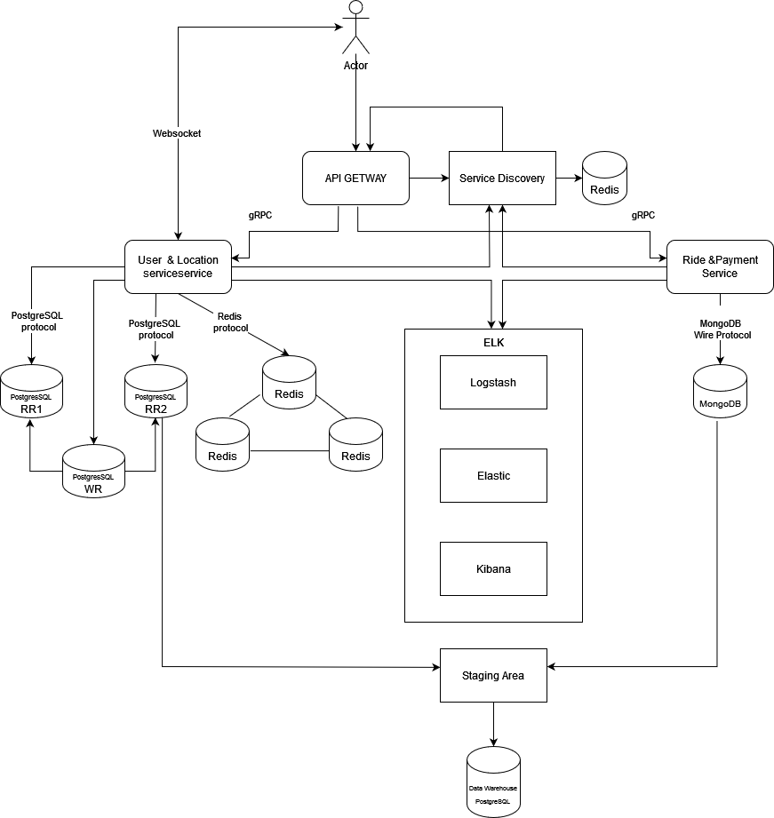

# Moldo-Uber
## Application Suitability
1. **Why is this application relevant?**
* **Efficient Transportation:** Ride-sharing apps provide convenient transportation solutions, especially in areas with limited public transport infrastructure (Ciocana Veche and Posta Veche).
* **Reduced Traffic Congestion:** By promoting shared rides, these apps help decrease the number of empty vehicles on the road, leading to less traffic congestion and a smaller carbon footprint.
* **Flexible Earnings for Drivers:**  Drivers have the opportunity to earn income on their own schedules, providing financial flexibility

2. **Why does this application require a microservice architecture?**
* **Scalability:** A ride-sharing app experiences fluctuating demand, requiring the ability to scale up or down quickly to accommodate peak usage. Microservices allow for independent scaling of specific components like the matching service or payment processing, ensuring optimal performance.
* **Modularity and Maintainability:** The diverse functionalities of a ride-sharing app (e.g., user management, ride matching, payments, location tracking) can be encapsulated within separate microservices. This enables independent development, deployment, and maintenance, facilitating continuous improvement and feature additions.
* **Fault Isolation:** In case of a service failure, microservices limit the impact to a specific area, preventing a complete system outage. For instance, if the payment service encounters issues, it won't disrupt the core ride-matching functionality.

## Service Boundaries



* **User Management & Location Tracking Service:** Handles user registration, authentication, profile management, and communication. Tracks the real-time location of drivers and riders during trips
* **Ride Matching & Payment Service:**  Matches riders with available drivers based on proximity and other criteria. Handles payment processing for rides.

## Technology Stack and Communication Patterns

* **User/Driver Management & Location Service:**
    * Language: Node.js
    * Framework: Express (gRPC server) + Socket.IO
    * Database: PostgreSQL & Redis
    * Exposes gRPC endpoints for user/driver management and real-time location updates
* **Ride & Payment Service:**
    * Language: Node.js
    * Framework: Express (gRPC server)
    * Database: MongoDB + Payment Gateway Integration
    * Exposes gRPC endpoints for ride matching and payment processing
* **API Gateway:**
    * Language: Python
    * Framework: Flask (RESTful API)
    * Handles external requests and routes them to appropriate microservices using gRPC

## Data Management
* **User Management & Delivery Service:**
```
    /api/users/register - Creates a new user account.
    /api/users/login - Authenticates a user and returns a session token.
    /api/users/profile - Retrieves user profile details.
    /api/users/profile/update - Updates user profile information.
    /api/drivers/register - Registers a new driver.
    /api/drivers/verify - Verifies a driver's documents and information.
    /api/drivers/location - Updates a driver's real-time location.
    /api/drivers/earnings - Retrieves a driver's earnings history.
    /api/notifications/send - Sends a notification to a user or driver.
```

* **Ride Matching & Payment Service:**

```
    /api/rides/request - Requests a ride from a user.
    /api/rides/match - Matches a rider with an available driver.
    /api/rides/status - Retrieves the current status of a ride.
    /api/rides/review - Leaving a commenet/mark for the ride.
    /api/payments/process - Processes payment for a completed ride.
    /api/payments/history - Processes payment for a completed ride.
    /api/payments/confirmation - Processes payment for a completed ride.
    /api/payments/status - Processes payment for a completed ride.
```
## User Management & Delivery Service

**POST /api/user/make_order**

```json

{
  "userId": "3",
  "startLongitude": 22,
  "startLatitude": 22,
  "endLongitude": 22,
  "endLatitude": 22
}
```


**POST /api/user/accept_order**

```json
{
  "orderId": "1a9f3fb0-6ca8-4c17-bf84-06853932e9ea",
  "driverId": "33"
}
```

**POST finish_order**

```json
{
  "rideId": "7610b0df-f0ca-4009-a832-af507c2d507e",
  "realPrice": 30.00
}
```
## Ride Matching & Payment Service

**POST /api/ride/pay**

```json
{
  "rideId": "7610b0df-f0ca-4009-a832-af507c2d507e",
  "amount": 150.25,
  "userId": "3"
}
```

**POST /api/ride/process_payment**

```json
{
  "rideId": "b51174f2-5a95-4dae-a85f-ad5629921385"
}
```

## WebSocket comunication 

**joining room**

```json
{
  "type": "join_room",
  "orderId": "123e4567-e89b-12d3-a456-426614174000",
  "userId": "user-001"
}
```

**POST /api/ride/process_payment**

```json
{
  "type": "send_message",
  "orderId": "123e4567-e89b-12d3-a456-426614174000",
  "userId": "user-001",
  "driverId": "driver-001",
  "content": "Hello, I am ready for pickup."
}
```

## Setup and Deployment

### Build the Docker Images
Use Docker Compose to build all the Docker images for the services:
```bash
docker-compose build
```

### Start the Services
Start all the services defined in the docker-compose.yml file:
```bash
docker-compose up
```

### Verify That the Services Are Running
Check the status of the containers:
```bash
docker-compose ps
```

## Database and Redis Access

### Accessing PostgreSQL (User Management & Delivery Service)
To check the data in PostgreSQL:
```bash
psql -U myuser -d userlocationdb
SELECT * FROM rides;
```

### Accessing MongoDB (Ride Payment Service)
To check payment data in MongoDB:
```bash
mongosh
use ridepaymentdb
db.payments.find().pretty()
```

### Accessing Redis (User Management & Delivery Service)
To check cached data in Redis:
```bash
redis-cli
keys *
```
### Circuit Breaker Pattern

The **Circuit Breaker Pattern** is essential in safeguarding Moldo-Uber from cascading failures, ensuring seamless functionality even when some services face issues. By employing a circuit breaker, the system can detect repetitive failures and halt calls to problematic services, reducing strain on the entire architecture. In our setup, we use Polly to handle transient faults with specific policies that wrap external service calls in the API Gateway. This approach ensures that any potential disruptions are isolated, protecting the ride-sharing experience from larger interruptions.

### ELK Stack

Centralized logging and monitoring are crucial for efficient observability within Moldo-Uber. The **ELK Stack** — Elasticsearch, Logstash, and Kibana — provides a robust solution, bringing all logs together in one place for easy access and visualization. Elasticsearch acts as the core repository, while Logstash gathers logs across all services, and Kibana presents them in visually rich dashboards. This setup enables us to monitor, analyze, and troubleshoot our application in real time, ensuring optimal performance and user satisfaction.

### Two-Phase Commit

The **Two-Phase Commit** pattern is implemented to ensure atomicity in distributed transactions, especially crucial for ride payments that span multiple databases. This approach, used by our Ride & Payment Service, secures that changes occur uniformly across services. The process involves two stages: the Prepare Phase, where each service secures resources and prepares for the change, followed by the Commit Phase, ensuring all services finalize the transaction or roll it back if issues arise. This methodology maintains data integrity across Moldo-Uber’s databases, supporting reliable and accurate transaction handling.

### Consistent Hashing for Cache

Efficient cache management is vital for a high-performance microservices architecture. **Consistent Hashing for Cache** allows Moldo-Uber to distribute cache entries evenly, reducing cache misses and ensuring scalable service. By setting up a Redis cluster, we implement consistent hashing, which allocates keys across nodes, promoting balanced data distribution. This approach keeps our caching layer responsive and efficient, even as the system scales.

### Cache High Availability

**Cache High Availability** in Moldo-Uber prevents downtime in the caching layer, ensuring data accessibility even during cache node failures. We set up Redis in a master-slave configuration, where each master node has replicas for redundancy. In case of a failure, the system seamlessly redirects requests to the available replicas, guaranteeing uninterrupted data flow and a smooth ride-booking experience for users.

### Database Replication and Failover

Data reliability is paramount in Moldo-Uber. **Database Replication and Failover** fortifies our PostgreSQL database by replicating data across multiple instances. With one primary and two standby replicas, the system maintains data availability and durability even in failure scenarios. This setup ensures continuous access to user and ride data, supporting resilient and consistent service.

### Data Warehouse and ETL

For comprehensive analytics and reporting, Moldo-Uber employs a **Data Warehouse and ETL** setup. By consolidating data from PostgreSQL and MongoDB, we create a unified repository that supports deep insights and trend analysis. Our ETL processes periodically sync data, transforming it into actionable intelligence. This data warehouse serves as the backbone for strategic decision-making, enabling Moldo-Uber to optimize services and drive informed growth.
