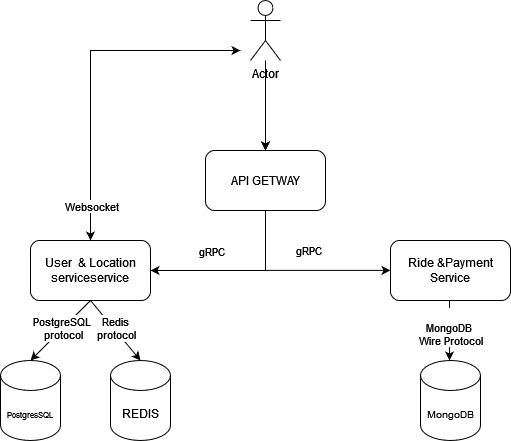

# Moldo-Uber
## Application Suitability
1. **Why is this application relevant?**
* **Efficient Transportation:** Ride-sharing apps provide convenient transportation solutions, especially in areas with limited public transport infrastructure (Ciocana Veche and Posta Veche).
* **Reduced Traffic Congestion:** By promoting shared rides, these apps help decrease the number of empty vehicles on the road, leading to less traffic congestion and a smaller carbon footprint.
* **Flexible Earnings for Drivers:**  Drivers have the opportunity to earn income on their own schedules, providing financial flexibility

2. **Why does this application require a microservice architecture?**
* **Scalability:** A ride-sharing app experiences fluctuating demand, requiring the ability to scale up or down quickly to accommodate peak usage. Microservices allow for independent scaling of specific components like the matching service or payment processing, ensuring optimal performance.
* **Modularity and Maintainability:** The diverse functionalities of a ride-sharing app (e.g., user management, ride matching, payments, location tracking) can be encapsulated within separate microservices. This enables independent development, deployment, and maintenance, facilitating continuous improvement and feature additions.
* **Fault Isolation:** In case of a service failure, microservices limit the impact to a specific area, preventing a complete system outage. For instance, if the payment service encounters issues, it won't disrupt the core ride-matching functionality.

## Service Boundaries


* **User Management & Location Tracking Service:** Handles user registration, authentication, profile management, and communication. Tracks the real-time location of drivers and riders during trips
* **Ride Matching & Payment Service:**  Matches riders with available drivers based on proximity and other criteria. Handles payment processing for rides.

## Technology Stack and Communication Patterns

* **User/Driver Management & Location Service:**
    * Language: Node.js
    * Framework: Express (gRPC server) + Socket.IO
    * Database: PostgreSQL & Redis
    * Exposes gRPC endpoints for user/driver management and real-time location updates
* **Ride & Payment Service:**
    * Language: Node.js
    * Framework: Express (gRPC server)
    * Database: MongoDB + Payment Gateway Integration
    * Exposes gRPC endpoints for ride matching and payment processing
* **API Gateway:**
    * Language: Python
    * Framework: Flask (RESTful API)
    * Handles external requests and routes them to appropriate microservices using gRPC

## Data Management
* **User Management & Delivery Service:**
```
    /api/users/register - Creates a new user account.
    /api/users/login - Authenticates a user and returns a session token.
    /api/users/profile - Retrieves user profile details.
    /api/users/profile/update - Updates user profile information.
    /api/drivers/register - Registers a new driver.
    /api/drivers/verify - Verifies a driver's documents and information.
    /api/drivers/location - Updates a driver's real-time location.
    /api/drivers/earnings - Retrieves a driver's earnings history.
    /api/notifications/send - Sends a notification to a user or driver.
```

* **Ride Matching & Payment Service:**

```
    /api/rides/request - Requests a ride from a user.
    /api/rides/match - Matches a rider with an available driver.
    /api/rides/status - Retrieves the current status of a ride.
    /api/rides/review - Leaving a commenet/mark for the ride.
    /api/payments/process - Processes payment for a completed ride.
    /api/payments/history - Processes payment for a completed ride.
    /api/payments/confirmation - Processes payment for a completed ride.
    /api/payments/status - Processes payment for a completed ride.
```
## User Management & Delivery Service

**POST /api/user/make_order**

```json

{
  "userId": "3",
  "startLongitude": 22,
  "startLatitude": 22,
  "endLongitude": 22,
  "endLatitude": 22
}


```


**POST /api/user/accept_order**

```json
{
  "orderId": "1a9f3fb0-6ca8-4c17-bf84-06853932e9ea",
  "driverId": "33"
}

```

**POST finish_order**

```json
{
  "rideId": "7610b0df-f0ca-4009-a832-af507c2d507e",
  "realPrice": 30.00
}

```
## Ride Matching & Payment Service

**POST /api/ride/pay**

```json
{
  "rideId": "7610b0df-f0ca-4009-a832-af507c2d507e",
  "amount": 150.25,
  "userId": "3"
}

```

**POST /api/ride/process_payment**

```json
{
  "rideId": "b51174f2-5a95-4dae-a85f-ad5629921385"
}


```

## Database and Redis Access

### Accessing PostgreSQL (User Management & Delivery Service)
To check the data in PostgreSQL:
```bash
docker exec -it <container_name> psql -U <postgres_user> -d <postgres_db>
```
Replace `<container_name>`, `<postgres_user>`, and `<postgres_db>` with the appropriate values.

### Accessing MongoDB (Ride Payment Service)
To check payment data in MongoDB:
```bash
docker exec -it <container_name> mongo
use ridepaymentdb
db.payments.find().pretty()
```

### Accessing Redis (User Management & Delivery Service)
To check cached data in Redis:
```bash
docker exec -it <container_name> redis-cli
keys *
```

## Deployment and Scaling

* Containerization: Each microservice will be packaged into Docker containers for consistent deployment across different environments.
* Orchestration: Kubernetes will be used to manage the deployment, scaling, and load balancing of containers, ensuring high availability and efficient resource utilization.
